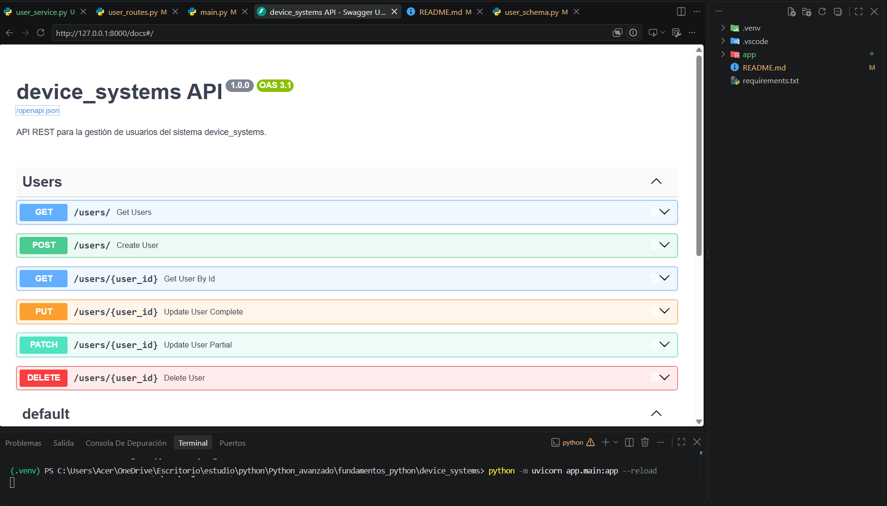
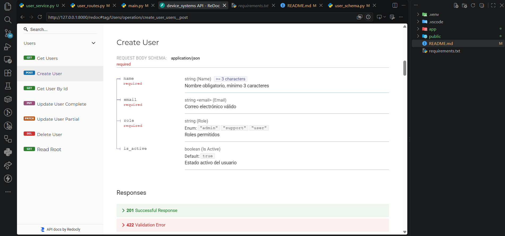
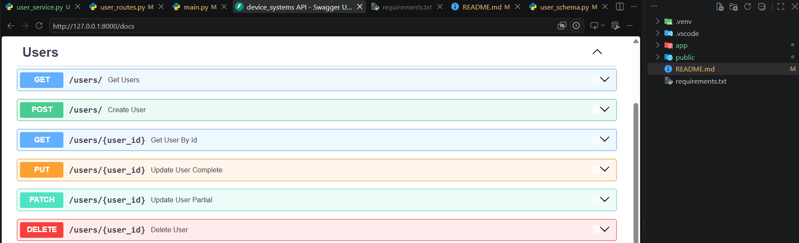
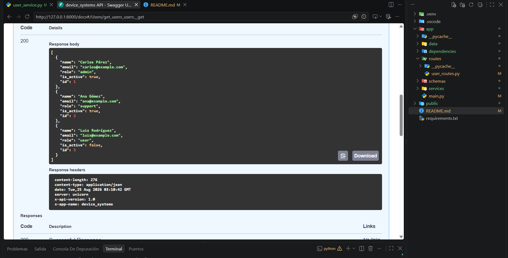
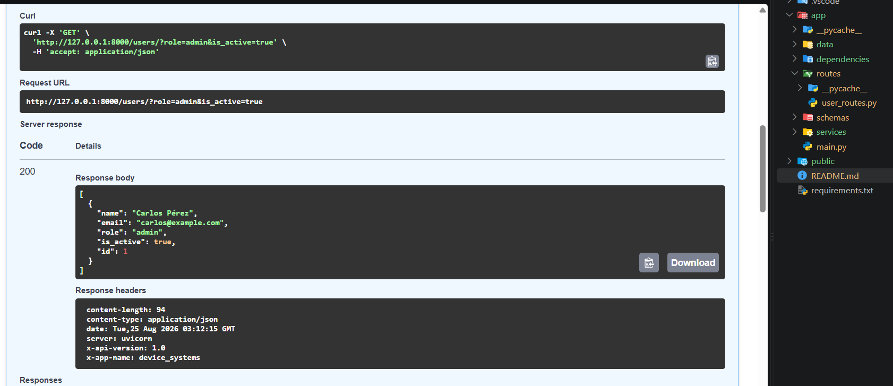
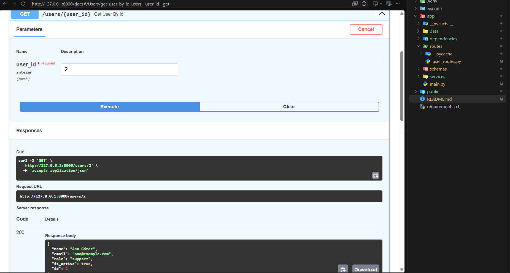
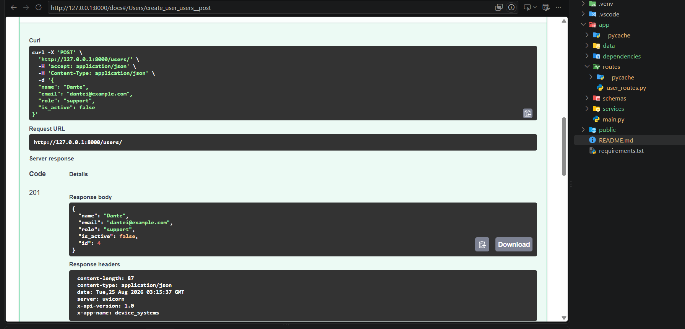
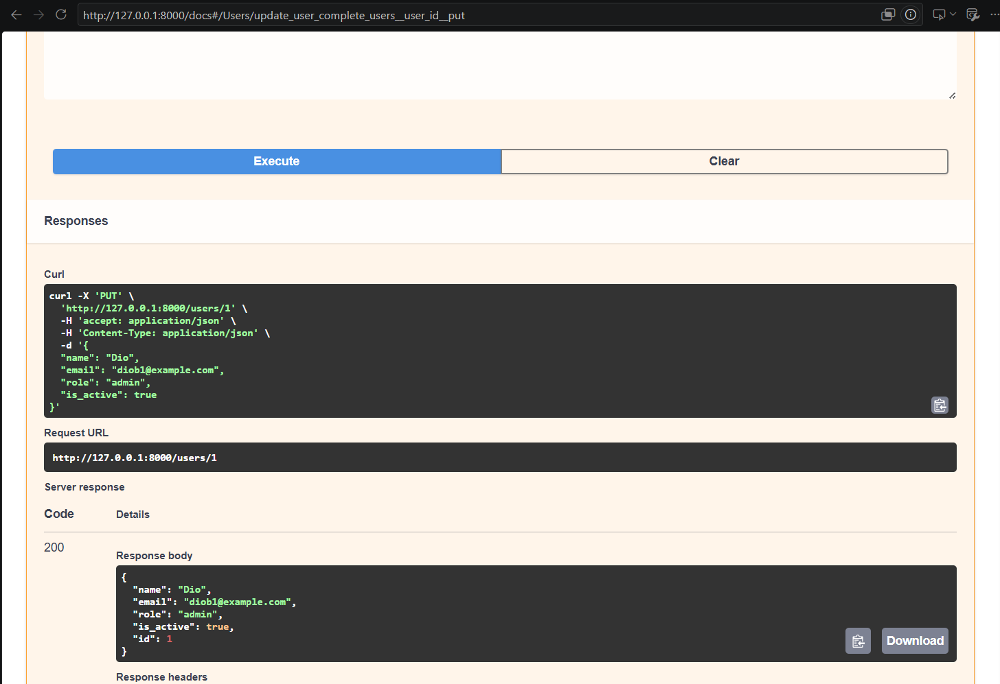
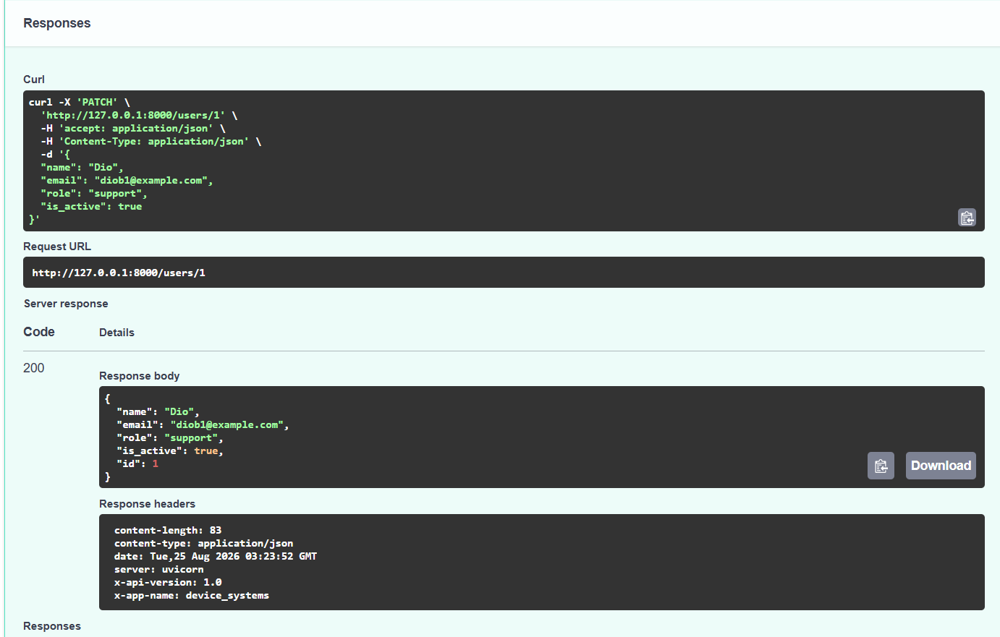
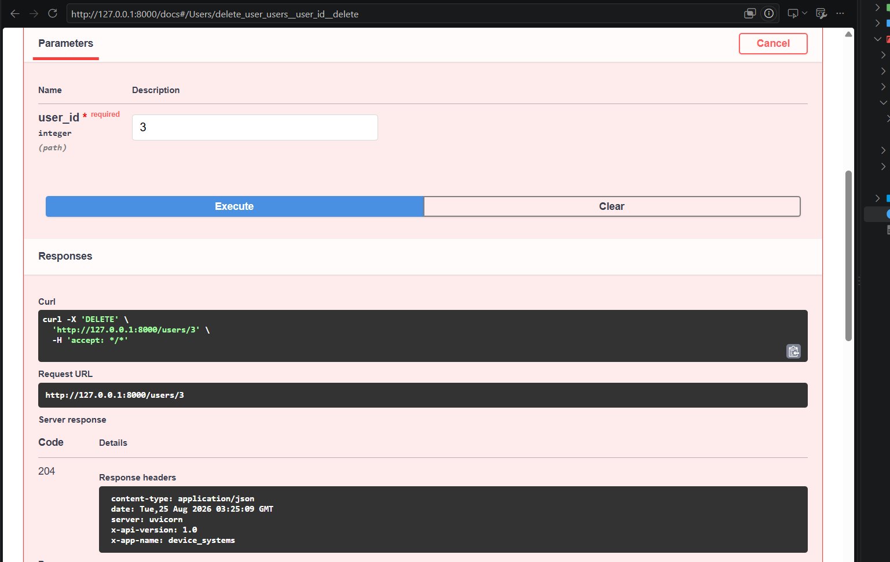

# 🚀 device_systems API

Aplicación backend desarrollada con **FastAPI** para construir una API REST enfocada en la gestión de usuarios, aplicando validaciones, parámetros de ruta y consulta, modelos de respuesta, operaciones CRUD completas y cabeceras HTTP personalizadas.

---

## 📋 Descripción de la aplicación
`device_systems` es un sistema backend optimizado para administrar de forma limpia y estructurada los perfiles de los usuarios del sistema. Implementa buenas prácticas de desarrollo en capas y control de errores HTTP estándar.

---

## 📂 Estructura del Proyecto
El proyecto está organizado en una arquitectura modular limpia:

```text
device_systems/
│
├── .venv/                   # Entorno virtual de Python
├── .gitignore               # Archivos ignorados por Git
├── requirements.txt         # Dependencias del proyecto
├── README.md                # Documentación del proyecto
│
├── app/                     # Paquete principal de la aplicación
    ├── main.py              # Punto de entrada de FastAPI y registro de routers
    ├── data/                # Capa de datos simulada en memoria (users_db.py)
    ├── schemas/             # Modelos de validación con Pydantic (user_schema.py)
    └── routes/              # Controladores y endpoints de la API (user_routes.py)
└──public
```
---
# ¿Qué es Pydantic?
---
Pydantic es la librería utilizada por FastAPI para validar y gestionar los datos mediante modelos y tipos de Python.

Permite comprobar automáticamente que los datos enviados por el cliente cumplan las reglas definidas, como el número mínimo de caracteres, tipos de datos y formatos de correo electrónico mediante EmailStr.

Además, FastAPI utiliza estos modelos para generar automáticamente parte de la documentación interactiva disponible en Swagger UI.

---
# Instalación y configuración

1. Crear el entorno virtual

``python -m venv .venv``

2. Activar el entorno virtual

source .venv/Scripts/activate

3. Instalar las dependencias

``pip install -r requirements.txt``
---
# Ejecución del servidor
---
Para iniciar el servidor de desarrollo con recarga automática:

``python -m uvicorn app.main:app --reload``

Servidor local:

http://127.0.0.1:8000
 Documentación automática

Swagger UI:

http://127.0.0.1:8000/docs

ReDoc:

http://127.0.0.1:8000/redoc
---
# Endpoints

| Método | Endpoint | Descripción | Parámetros |
|---|---|---|---|
| `GET` | `/users` | Lista todos los usuarios. | `role`, `is_active` *(Query opcionales)* |
| `GET` | `/users/{user_id}` | Consulta un usuario específico. | `user_id` *(Path)* |
| `POST` | `/users` | Registra un nuevo usuario. | `Body: UserCreate` |
| `PUT` | `/users/{user_id}` | Actualiza completamente un usuario. | `user_id` *(Path)* + `Body: UserCreate` |
| `PATCH` | `/users/{user_id}` | Actualiza parcialmente un usuario. | `user_id` *(Path)* + `Body: UserUpdate` |
| `DELETE` | `/users/{user_id}` | Elimina un usuario existente. | `user_id` *(Path)* |

Parámetros
``user_id``: Path Parameter utilizado para identificar un usuario.

``role``: Query Parameter para filtrar por admin, support o user.

``is_active``: Query Parameter para filtrar usuarios activos o inactivos.
---
# Ejemplos de peticiones

1. Registrar un usuario

POST /users


{

    "name": "Dante",
    "email": "dantei@example.com",
    "role": "support",
    "is_active": false
}

Respuesta esperada:

201 Created

{

    "name": "Dante",
    "email": "dantea@example.com",
    "role": "support",
    "is_active": false,
    "id": 4
}
--
2. Consultar usuarios filtrados

GET ``/users?role=admin``

Este endpoint devuelve únicamente los usuarios cuyo rol corresponde a admin.

También es posible filtrar por estado:

GET ``/users?is_active=true``

La API incluye las siguientes cabeceras personalizadas:

X-App-Name: device_systems
X-API-Version: 1.0
 Validaciones y manejo de errores

La API valida los datos recibidos mediante Pydantic y controla diferentes situaciones de error.

Entre ellas:

-Usuario inexistente.

-Correo electrónico duplicado.

-Rol no permitido.

-Datos inválidos.

-Intentos de actualización sobre usuarios inexistentes.

-Eliminación de usuarios inexistentes.

-Solicitudes PATCH sin datos para actualizar.

Los errores utilizan códigos HTTP apropiados para comunicar correctamente el resultado de cada operación.
---
##  Códigos de estado HTTP

| Código | Nombre | Uso en `device_systems` |
|---:|---|---|
| `200` | OK | Operación realizada correctamente. |
| `201` | Created | Usuario creado correctamente mediante `POST`. |
| `204` | No Content | Usuario eliminado correctamente sin devolver contenido. |
| `400` | Bad Request | Solicitud incorrecta, como correo duplicado o `PATCH` vacío. |
| `404` | Not Found | El usuario solicitado no existe. |
| `422` | Unprocessable Entity | Los datos enviados no cumplen las validaciones de Pydantic. |

# Evidencias


Swagger UI (/docs).


ReDoc (/redoc).


GET /users.




GET /users/{user_id}.


POST /users.


PUT /users/{user_id}.


PATCH /users/{user_id}.


DELETE /users/{user_id}.


---
# Reflexión sobre FastAPI
---
El uso de FastAPI facilita la construcción de APIs REST gracias al tipado de Python, la validación automática mediante Pydantic y la generación de documentación interactiva. Esto permite desarrollar aplicaciones más organizadas, reducir código repetitivo y detectar errores en los datos enviados por los clientes.

La evolución de device_systems permitió pasar de una API básica con operaciones GET y POST a una solución con CRUD completo, manejo de errores, códigos de estado HTTP, documentación automática y separación de responsabilidades.

---
# Johan Franco R. ADSO