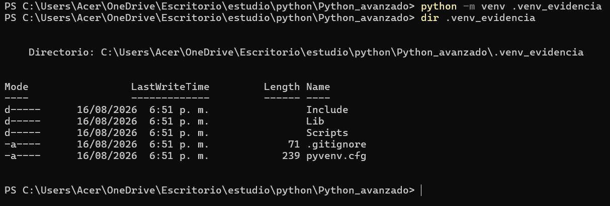
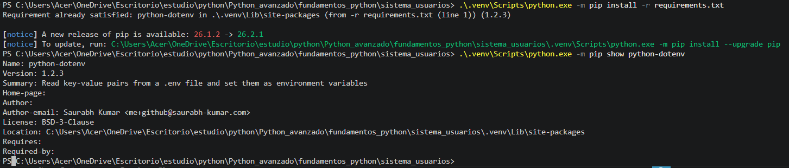
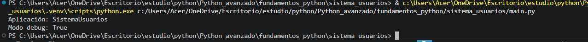
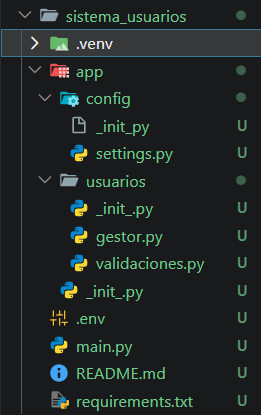
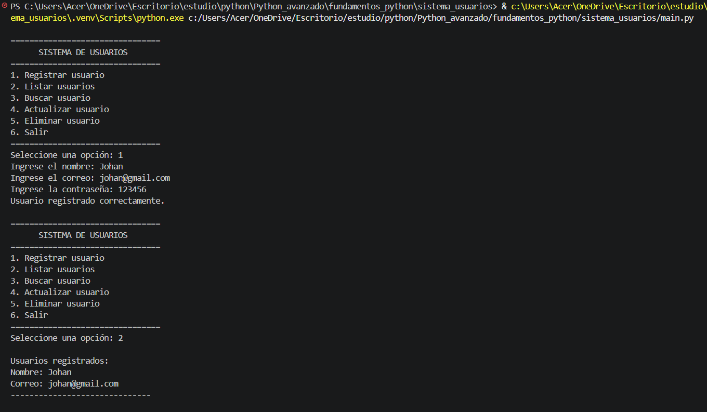
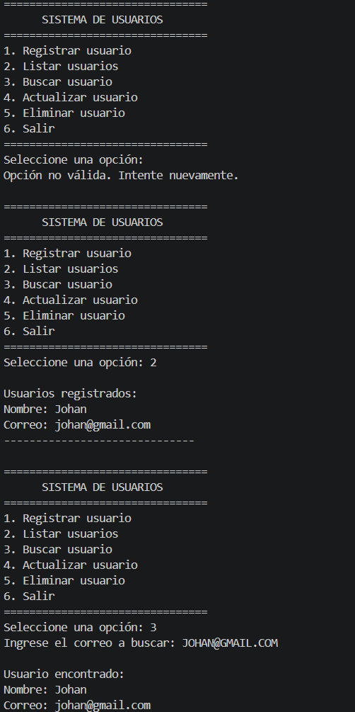
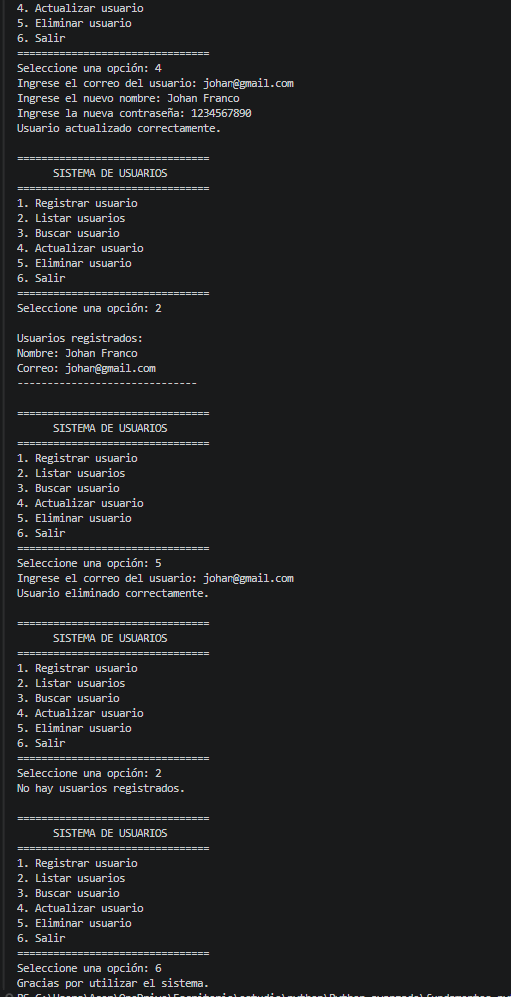

# Sistema de Usuarios

Sistema desarrollado en Python para gestionar usuarios mediante consola. Permite registrar, listar, buscar, actualizar y eliminar usuarios.

## Estructura

```text
sistema_usuarios/
├── app/
│   ├── config/settings.py
│   └── usuarios/
│       ├── gestor.py
│       └── validaciones.py
├── .env
├── .venv/
├── main.py
└── requirements.txt
```

El proyecto está dividido por responsabilidades: `main.py` controla el menú, `gestor.py` administra los usuarios, `validaciones.py` comprueba los datos y `settings.py` gestiona la configuración.

## Entorno virtual

Se creó un entorno aislado con:

```bash
python -m venv .venv
```

Esto permite mantener las dependencias del proyecto separadas del Python global.

**Evidencia:**



## Dependencias

Las dependencias se registran en `requirements.txt`:

```text
python-dotenv
```

Se instalan mediante:

```bash
pip install -r requirements.txt
```

## Variables de entorno

La configuración se almacena en `.env`:

```env
APP_NAME=Sistema de Usuarios
DEBUG=True
```
## Ejecucion 


`settings.py` utiliza `python-dotenv` para cargar estas variables.

**Evidencia:**


## Ejecución

El sistema se ejecuta con:

```bash
python main.py
```

Cuenta con opciones para registrar, consultar, buscar, actualizar y eliminar usuarios.

**Evidencia:**




## Ventajas de la organización

La modularización permite separar responsabilidades, mantener el código ordenado y facilitar futuras modificaciones. El entorno virtual evita conflictos entre dependencias de diferentes proyectos y permite reproducir fácilmente el entorno de desarrollo.
