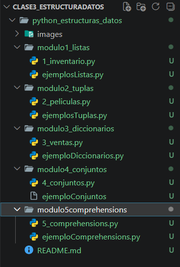
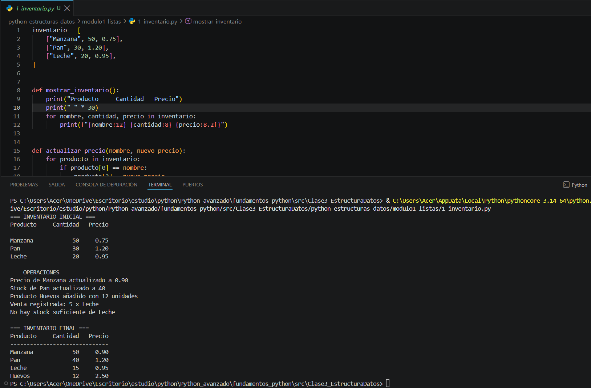
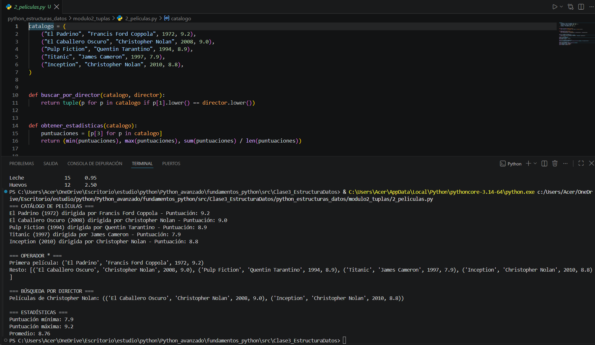
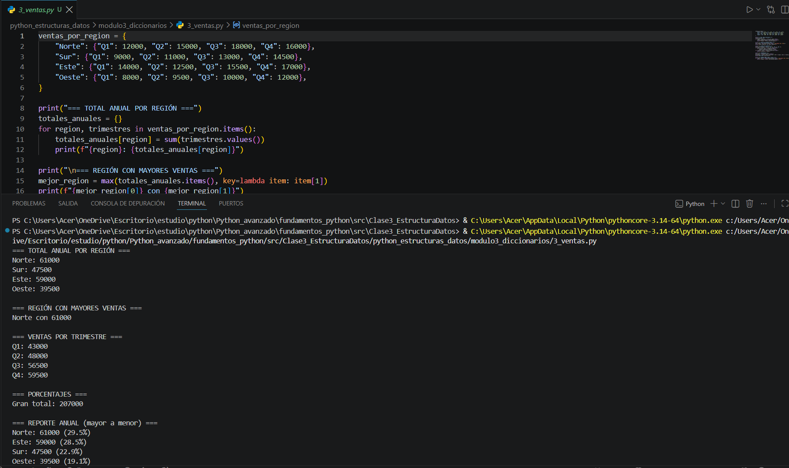
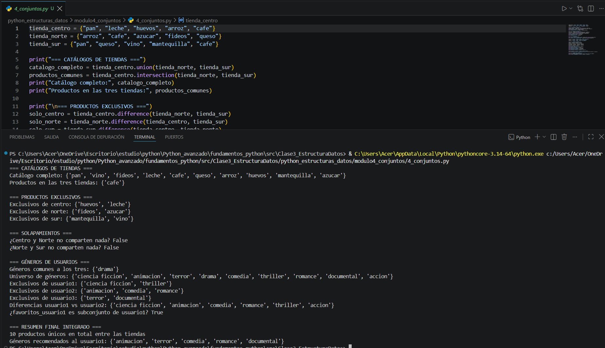
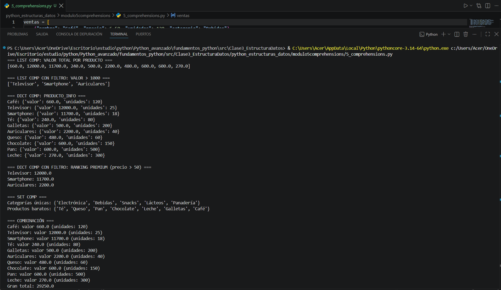

# Retos de Python – Estructuras de Datos

Proyecto de práctica de **estructuras de datos en Python**, organizado en cinco módulos: listas, tuplas, diccionarios, conjuntos y comprehensions.

## Requisitos

* Python 3.x
* Visual Studio Code o cualquier editor compatible con Python.

## Estructura del proyecto

```text
python_estructuras_datos/
│
├── Images/
│   ├── Clase3_Estructura.png
│   ├── Ejecucion_1Inventario.png
│   ├── Ejecucion_2Peliculas.png
│   ├── Ejecucion_3Ventas.png
│   ├── Ejecucion_4Conjuntos.png
│   └── Ejecucion_5Comprehensions.png
│
├── modulo1_listas/
|   ├──ejemploListas.py
│   └── 1_inventario.py
│
├── modulo2_tuplas/
|   ├──ejemplosTuplas.py
│   └── 2_peliculas.py
│
├── modulo3_diccionarios/
|   ├──ejemploDiccionarios.py
│   └── 3_ventas.py
│
├── modulo4_conjuntos/
|   ├──ejemploConjuntos.py
│   └── 4_conjuntos.py
│
├── modulo5comprehensions/
|   ├──ejemploComprehensions.py
│   └── 5_comprehensions.py
│
└── README.md
```

Cada carpeta de módulo contiene **los ejemplos desarrollados durante la práctica y el reto correspondiente**, organizados según la estructura de datos estudiada.
### Evidencia 1


## Módulos desarrollados

### 1. Listas – Sistema de inventario

Contiene ejemplos de **listas y listas anidadas**, además del reto de inventario para practicar modificación de elementos, recorridos y funciones.
### Evidencia 2


### 2. Tuplas – Catálogo de películas

Contiene ejemplos sobre **tuplas e inmutabilidad**, desempaquetado, búsquedas y el reto de catálogo de películas.
### Evidencia 3


### 3. Diccionarios – Ventas

Contiene ejemplos de **diccionarios y diccionarios anidados**, junto con el reto de análisis de ventas por región y trimestre.
### Evidencia 4


### 4. Conjuntos

Contiene ejemplos sobre **sets y sus operaciones**, además del reto utilizando unión, intersección, diferencia, diferencia simétrica y subconjuntos.
### Evidencia 5


### 5. Comprehensions

Contiene ejemplos de **List, Dict y Set Comprehensions**, junto con el reto de transformación, filtrado y organización de datos de ventas.
### Evidencia 6



## Conceptos trabajados

* Listas y listas anidadas.
* Tuplas e inmutabilidad.
* Diccionarios y diccionarios anidados.
* Conjuntos y operaciones matemáticas.
* List comprehension.
* Dict comprehension.
* Set comprehension.
* Funciones.
* Recorridos e iteraciones.
* Condicionales.
* `lambda`, `sorted()`, `sum()`, `min()` y `max()`.

## Conclusión

Los retos permitieron practicar las principales **estructuras de datos de Python** mediante ejemplos y ejercicios prácticos, fortaleciendo el manejo de colecciones, funciones, recorridos, filtros y transformaciones de información.
