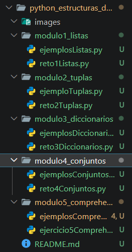
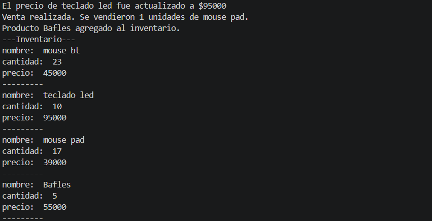
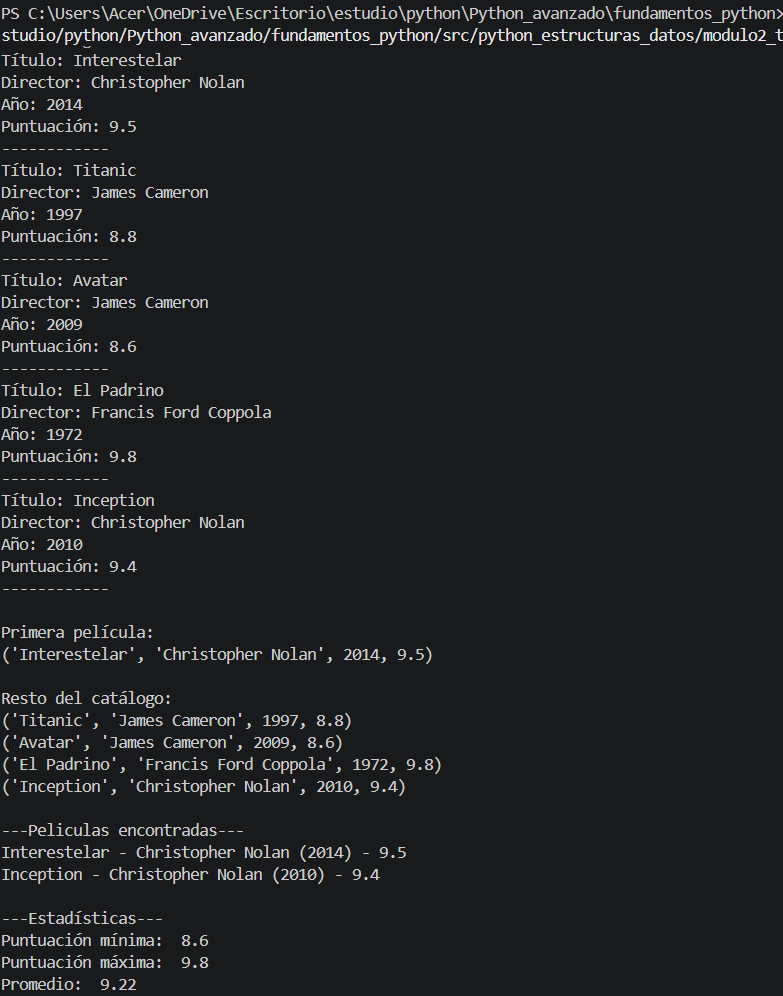
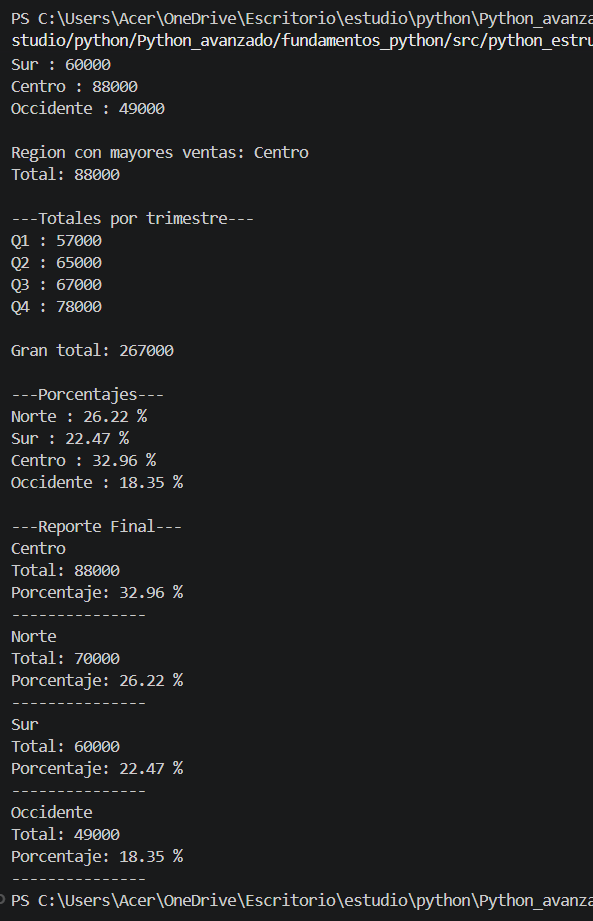
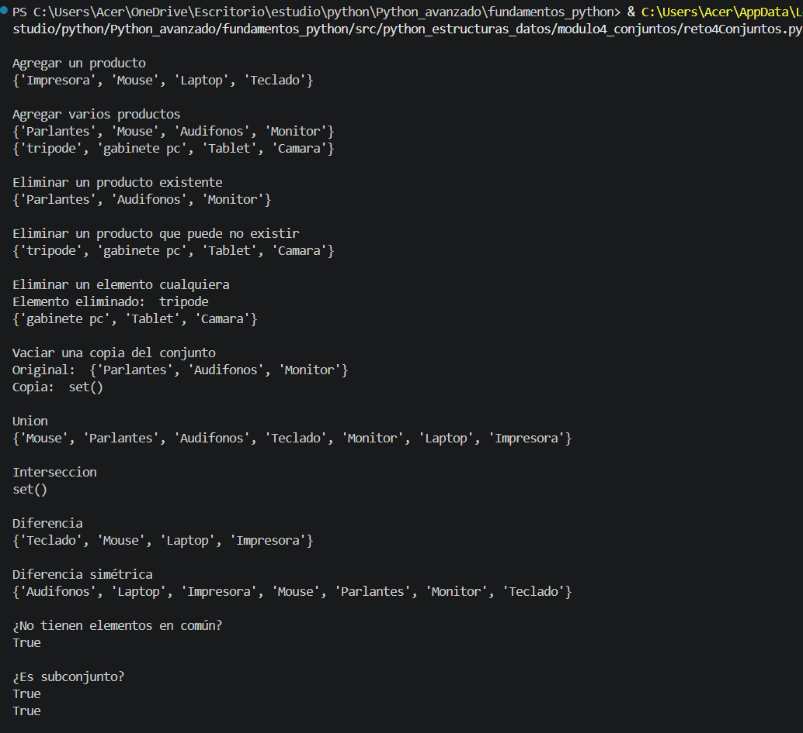
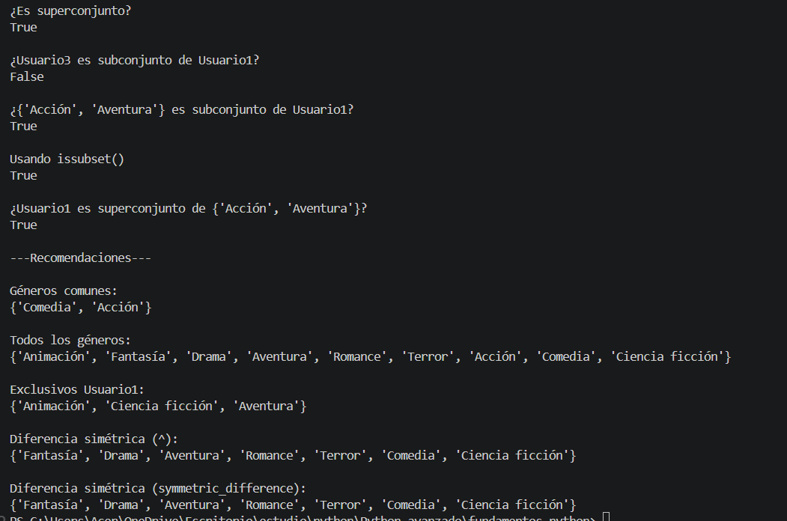
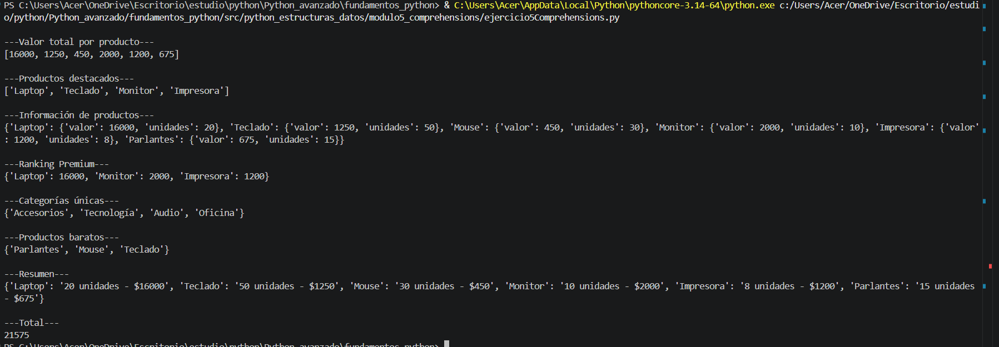

<!-- README.md de la carpeta sobre estructura de datos con su propia documentacion  -->
# Python - Estructuras de Datos
## Descripción del proyecto

Este proyecto contiene el desarrollo de los cinco módulos sobre estructuras de datos en Python propuestos en el recurso educativo.
En cada módulo se replicaron los ejemplos presentados y posteriormente se resolvió el reto correspondiente aplicando los conceptos aprendidos.
El proyecto fue desarrollado como evidencia de aprendizaje de la actividad del curso.
---

## Objetivos
- Comprender las principales estructuras de datos de Python.
- Replicar ejemplos prácticos.
- Resolver retos utilizando listas, tuplas, diccionarios, conjuntos y comprehensions.
- Aplicar buenas prácticas de organización de proyectos.
---

## Temas aprendidos
---
### Módulo 1 - Listas
- Creación de listas
- Acceso mediante índices
- Slicing
- append()
- insert()
- extend()
- remove()
- pop()
- del
- clear()
- sort()
- reverse()
- sorted()
- copy()
- deepcopy()
- Recorridos con for
- enumerate()
- zip()
- List Comprehension
---
### Módulo 2 - Tuplas
- Creación de tuplas
- Tuplas inmutables
- Acceso por índices
- Slicing
- count()
- index()
- Desempaquetado
- Operador *
- Retorno múltiple de funciones
---
### Módulo 3 - Diccionarios
- Creación de diccionarios
- Acceso mediante claves
- get()
- update()
- pop()
- popitem()
- setdefault()
- fromkeys()
- items()
- keys()
- values()
- Comprensión de diccionarios
- Diccionarios anidados
---
### Módulo 4 - Conjuntos
- Creación de sets
- add()
- update()
- remove()
- discard()
- pop()
- clear()
- union()
- intersection()
- difference()
- symmetric_difference()
- isdisjoint()
- issubset()
- issuperset()
- Operadores &, |, -, ^
---
### Módulo 5 - Comprehensions
- List Comprehension
- Dict Comprehension
- Set Comprehension
- Filtros con if
- Transformación de datos
- Uso de sum()
- sorted()
- lambda 
---
## capturas de pruebas
---
### estructura proyecto

---
### modulo 1

---
### modulo 2

---
### modulo 3

---
### modulo 4

---
### modulo 5

---
## Reflexion

En estos 5 modulos aprendi que las funciones que guardan informacion pueden resultar muy utiles y no todas funcionan igual, todo depende a que se quiera aplicar y que quiere solucionar cada uno, tambien reforce cosas de python y aunque no use todos los comando enseñados en los ejercicios o retos intente aplicar los mas necesarios y que a mi me parecian más importantes, puesto que son los que mas podria a llegar a utilizar como los de add, remove, for x in, etc.
